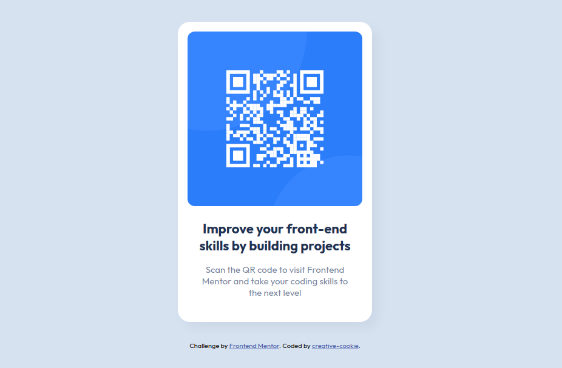

# Frontend Mentor - QR code component solution

This is a solution to the [QR code component challenge on Frontend Mentor](https://www.frontendmentor.io/challenges/qr-code-component-iux_sIO_H). Frontend Mentor challenges help you improve your coding skills by building realistic projects. 

## Table of contents

- [Overview](#overview)
  - [Screenshot](#screenshot)
  - [Links](#links)
- [My process](#my-process)
  - [Built with](#built-with)
  - [What I learned](#what-i-learned)

## Overview

### Screenshot

### Links

- [View Live Solution](https://creative-cookie.github.io/qr-card-component/)

## My process

### Built with

- HTML
- CSS

### What I learned

While I didn't learn anything new with this project, I found it to be good practice to reinforce what I've learned of HTML and CSS so far.